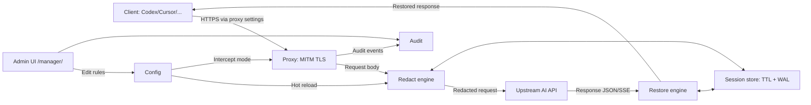

# VibeGuard

English | [中文](README.zh-CN.md)

VibeGuard is a MITM HTTPS proxy that helps protect sensitive data when using AI
coding assistants (e.g., Codex/Claude Code/Cursor/Copilot). It intercepts HTTPS
traffic, redacts sensitive content in requests, and restores placeholders in
responses (including JSON and SSE).

## Key Features

- **Redaction rules**: keywords only (exact substring match; only the matched substring is replaced).
- **Safe by default**: only scans text-like bodies (e.g., `application/json`) up to 10MB.
- **Admin UI**: manage rules, certificates, sessions, per-request “redaction hit” events at `/manager/`, and tail debug logs at `#/logs`.
- **Admin auth**: the admin UI/API is protected by a password (set on first visit to `/manager/`).
- **At-rest encryption (keywords)**: keyword/exclude values are stored encrypted in `~/.vibeguard/config.yaml` using a key derived from the local CA private key (admin UI still shows plaintext). If you regenerate the CA, old encrypted values cannot be decrypted.
- **Two interception modes**: `proxy.intercept_mode: global` (recommended for most clients) or `targets`.
- **Hot reload**: pattern/target changes from the admin UI take effect without restarting.

## Architecture



## Screenshots


## Quick Start (from source)

```bash
go run ./cmd/vibeguard init
go run ./cmd/vibeguard start --foreground
```

## Admin UI Security

- First visit to `http://127.0.0.1:28657/manager/` will ask you to set an admin password.
- The password is stored as a bcrypt hash in `~/.vibeguard/admin_auth.json` (permissions: `0600`).
- Forgot it? Stop VibeGuard, delete `~/.vibeguard/admin_auth.json`, then refresh `/manager/` to set a new one.
- Keep the admin UI bound to localhost (`127.0.0.1`) and avoid exposing the port to LAN/public networks.

## Install (script)

macOS/Linux:

```bash
bash install.sh
```

The installer is interactive (language, PATH, CA trust, autostart). The selected language is remembered for the admin UI and uninstall script.

Windows (PowerShell):

```powershell
powershell -ExecutionPolicy Bypass -File .\\install.ps1
```

The PowerShell installer is interactive too (and remembers the selected language).

## Uninstall

macOS/Linux:

```bash
bash uninstall.sh
bash uninstall.sh --purge
```

Windows (PowerShell):

```powershell
powershell -ExecutionPolicy Bypass -File .\\uninstall.ps1
powershell -ExecutionPolicy Bypass -File .\\uninstall.ps1 -Purge
```

The uninstallers try to remove the trusted CA (“VibeGuard CA”) automatically. If it fails (e.g., permissions), remove it manually.

## Docker

By default, `docker-compose.yml` uses the prebuilt image from GHCR (binds to localhost only):

```bash
docker compose pull
docker compose up -d
```

Build from source (contributors / before the first release image exists):

```bash
docker compose -f docker-compose.yml -f docker-compose.source.yml up -d --build
```

Tip: enabling BuildKit can speed up source rebuilds:

```bash
DOCKER_BUILDKIT=1 docker compose -f docker-compose.yml -f docker-compose.source.yml build
```

View logs:

```bash
docker compose logs -f vibeguard
```

Export CA cert from the container:

```bash
docker compose exec -T vibeguard cat /root/.vibeguard/ca.crt > vibeguard-ca.crt
```

Trust the CA on your host:

- macOS (system keychain):

```bash
sudo security add-trusted-cert -d -r trustRoot -k /Library/Keychains/System.keychain vibeguard-ca.crt
```

- Linux (Debian/Ubuntu):

```bash
sudo cp vibeguard-ca.crt /usr/local/share/ca-certificates/vibeguard-ca.crt
sudo update-ca-certificates
```

- Windows (run as Administrator):

```powershell
certutil -addstore -f Root vibeguard-ca.crt
```

Client setup:

- Proxy URL: `http://127.0.0.1:28657`
- Admin UI: `http://127.0.0.1:28657/manager/`

For CLI assistants, launch them via VibeGuard (process-only):

```bash
vibeguard codex [args...]
vibeguard claude [args...]
vibeguard gemini [args...]
vibeguard opencode [args...]
vibeguard qwen [args...]
vibeguard run <command> [args...]
```

For IDE/GUI apps (Cursor, etc), set the app’s proxy URL to `http://127.0.0.1:28657`.

Reset the container state (regenerates CA/config; requires re-trusting):

```bash
docker compose down -v
```

## Certificates (macOS/Linux)

To MITM HTTPS, your client must trust the generated CA:

```bash
go run ./cmd/vibeguard trust --mode system   # may require sudo
```

## Configuration

- Global: `~/.vibeguard/config.yaml`
- Project override: `.vibeguard.yaml`
- Override path: `VIBEGUARD_CONFIG=/path/to/config.yaml`

## CLI

Full command reference: `CLI.md`. (Everything is also listed here.)

Global flag:

- `-c, --config PATH`: config file (default `~/.vibeguard/config.yaml`).

### Start proxy service (background by default)

```bash
vibeguard start [--foreground] [-c PATH]
```

- Default: starts as a background service/process (if available).
- `--foreground`: run in foreground (service/debugging).
- If `--config` is set, it runs in foreground (to avoid ambiguity).

### Stop proxy service/process

```bash
vibeguard stop [-c PATH]
```

### Run Claude Code with proxy (process-only)

```bash
vibeguard claude [args...]
```

### Run other assistants with proxy (process-only)

```bash
vibeguard codex [args...]
vibeguard gemini [args...]
vibeguard opencode [args...]
vibeguard qwen [args...]
```

### Run any command with proxy (process-only)

```bash
vibeguard run <command> [args...]
```

### Init wizard

```bash
vibeguard init [-c PATH]
```

Interactive first-time setup (config + CA).

### Trust CA certificate (required for HTTPS MITM)

```bash
vibeguard trust --mode system|user|auto [-c PATH]
```

Installs the generated CA to a trust store so clients can accept MITM TLS. (May require `sudo`/Administrator.)

### Test a redaction rule

```bash
vibeguard test [pattern] [text] [-c PATH]
```

`pattern` is treated as a keyword (exact substring match).

Examples:

```bash
vibeguard test "test123" "Please repeat the word I just said, and remove its first letter."
```

### Version

```bash
vibeguard version
```

### Shell completion

```bash
vibeguard completion bash|zsh|fish|powershell [--no-descriptions]
```

### Help

```bash
vibeguard --help
vibeguard help [command]
vibeguard [command] --help
```

## Verify It Works (Vibe coding)

1. Start the proxy: `vibeguard start` (the installer can do this automatically).
2. Trust the CA once: `vibeguard trust --mode system` (may require `sudo`/Administrator).
3. Launch your tool via VibeGuard (`vibeguard codex/claude/...`) or set your IDE/app proxy URL to `http://127.0.0.1:28657`.
4. In `/manager/`, check the **Audit** panel: each request shows whether redaction was attempted and how many matches were replaced.

## Development

```bash
go test ./...
go vet ./...
gofmt -w .
```

## Star History

[](https://star-history.com/#inkdust2021/VibeGuard&Date)
