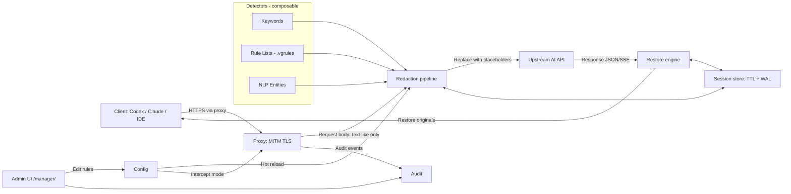

<p align="center">
  <br>
  <em>Rule-speed efficiency, NLP-grade accuracy—Seamless privacy for your AI coding vibe.</em><br>
  <a href="LICENSE"></a>
  <a href="go.mod"></a>
  <a href="https://github.com/inkdust2021/VibeGuard/actions/workflows/ghcr.yml"></a>
  <a href="https://ghcr.io/inkdust2021/vibeguard"></a>
  <a href="https://github.com/inkdust2021/VibeGuard/stargazers"></a>
  <br>
  English | <a href="README.zh-CN.md">中文</a>
</p>

## Installation

```bash
# Mac/Linux
curl -fsSL https://raw.githubusercontent.com/inkdust2021/VibeGuard/main/install | bash

# Windows
powershell -NoProfile -ExecutionPolicy Bypass -Command "irm https://raw.githubusercontent.com/inkdust2021/VibeGuard/main/install.ps1 | iex"
```

## Introduction

VibeGuard is a lightweight MITM HTTPS proxy for protecting sensitive data when vibecoding. It aims to be out-of-the-box and minimize disruption, and it can also integrate optional NLP.

- Process-only proxy launcher: `vibeguard codex/claude/gemini/opencode/qwen...`
- Admin UI: configure rules and review audit hits at `http://127.0.0.1:28657/manager/`
- Placeholder restore for JSON / SSE responses

## Key Features

- **Matching rules**: rule lists (official + third-party) + keywords (exact string match) + optional generic entity recognition (NLP).
- **NLP (optional)**: supports BERT/DistilBERT-style **token-classification (NER) + WordPiece** models (requires `model.onnx`, `vocab.txt`, `labels.txt`, optional `vibeguard_ner.json`). See `docs/README.md`.
- **Rule lists**: upload/subscribe to `.vgrules` lists (remote subscriptions support ed25519 signatures or pinned SHA-256). See `docs/README.md`.
- **Safe by default**: only scans text-like request bodies (e.g., `application/json`) with a 10MB limit.
- **Admin UI**: configure rules/certificates/sessions at `/manager/`, review per-request redaction hits (Audit), and tail backend debug logs at `#/logs`.
- **Admin auth**: the admin UI/API is protected by a password (set on first visit to `/manager/`).
- **At-rest encryption (keywords)**: keyword/exclude values are stored encrypted in `~/.vibeguard/config.yaml` using a key derived from the local CA private key (admin UI still shows plaintext). If you regenerate the CA, old encrypted values cannot be decrypted and must be reconfigured.
- **Two interception modes**: `proxy.intercept_mode: global` or `targets`.
- **Hot reload**: rule/target updates from the admin UI take effect without restarting.

## Architecture


```mermaid
flowchart LR
  C[Client: Codex / Claude / IDE] -->|HTTPS via proxy| P[Proxy: MITM TLS]
  P -->|Request body: text-like only| PIPE[Redaction pipeline]
  PIPE -->|Replace with placeholders| U[Upstream AI API]
  U -->|Response JSON/SSE| S[Restore engine]
  S -->|Restore originals| C

  subgraph DET[Detectors - composable]
    KW[Keywords]
    RL[Rule Lists - .vgrules]
    NLP[NLP Entities]
  end
  KW --> PIPE
  RL --> PIPE
  NLP --> PIPE

  UI[Admin UI /manager/] -->|Edit rules| CFG[Config]
  CFG -->|Hot reload| PIPE
  CFG -->|Intercept mode| P

  PIPE <--> SES[Session store: TTL + WAL]
  S <--> SES

  P -->|Audit events| A[Audit]
  UI --> A
```

## Screenshot


## Admin UI Security

- First visit to `http://127.0.0.1:28657/manager/` will ask you to set an admin password.
- The password is stored as a bcrypt hash in `~/.vibeguard/admin_auth.json` (permissions: `0600`).
- Forgot it? Stop VibeGuard, delete `~/.vibeguard/admin_auth.json`, then refresh `/manager/` to set a new one.
- Keep the admin UI bound to localhost (`127.0.0.1`) and avoid exposing the port to LAN/public networks.

## Uninstall

macOS/Linux:

```bash
bash uninstall.sh
bash uninstall.sh --purge
bash uninstall.sh --docker
bash uninstall.sh --docker --docker-volume
```

Note: `--docker-volume` removes the `vibeguard-data` Docker volume (container config + CA will be lost).

Windows (PowerShell):

```powershell
powershell -ExecutionPolicy Bypass -File .\\uninstall.ps1
powershell -ExecutionPolicy Bypass -File .\\uninstall.ps1 -Purge
```

The uninstallers try to remove the trusted CA (“VibeGuard CA”) automatically. If it fails (e.g., permissions), remove it manually.

## Configuration

- Global: `~/.vibeguard/config.yaml`
- Project override: `.vibeguard.yaml`
- Override path: `VIBEGUARD_CONFIG=/path/to/config.yaml`

## CLI Commands

Global flag:

- `-c, --config PATH`: config file (default `~/.vibeguard/config.yaml`).

### Start proxy (background by default)

```bash
vibeguard start [--foreground] [-c PATH]
```

- Default: prefers an installed autostart service; otherwise starts a background process.
- `--foreground`: run in foreground (debugging / service ExecStart).
- If `--config` is set, it runs in foreground (to avoid ambiguity).

### Stop proxy (background service/process)

```bash
vibeguard stop [-c PATH]
```

### Enable proxy only for Code Agents (does not affect your current terminal)

```bash
vibeguard opencode/claude/codex... [args...]
```

### Enable proxy only for a command (does not affect your current terminal)

```bash
vibeguard run <command> [args...]
```

### Init wizard

```bash
vibeguard init [-c PATH]
```

Interactive config + CA generation.

### Trust CA certificate (required for HTTPS MITM)

```bash
vibeguard trust --mode system|user|auto [-c PATH]
```

Installs the generated CA into a trust store. (May require `sudo`/Administrator.)

### Test a redaction rule

```bash
vibeguard test [pattern] [text] [-c PATH]
```

`pattern` is treated as a keyword (exact substring match).

Example:

```bash
vibeguard test "test123" "Please repeat the word I just said, and remove its first letter."
```

### Version

```bash
vibeguard version
```

### Shell completion

```bash
vibeguard completion bash|zsh|fish|powershell [--no-descriptions]
```

### Help

```bash
vibeguard --help
vibeguard help [command]
vibeguard [command] --help
```

## How to Verify It Works (Vibecoding)

1. Start the proxy: `vibeguard start` (the installer can do this automatically).
2. Trust the CA once: `vibeguard trust --mode system` (may require `sudo`/Administrator).
3. Launch your tool via VibeGuard (`vibeguard codex/claude/...`) or set your IDE/app proxy URL to `http://127.0.0.1:28657`.
4. In `/manager/`, check the **Audit** panel: each request shows whether redaction was attempted and how many matches were replaced.

## Development & Self-check

```bash
go test ./...
go vet ./...
gofmt -w .
```

## Included officially

VibeGuard is officially integrated by:

- OpenCode: https://github.com/inkdust2021/opencode-vibeguard

## Star History

[](https://www.star-history.com/#inkdust2021/VibeGuard&type=date&legend=top-left)
