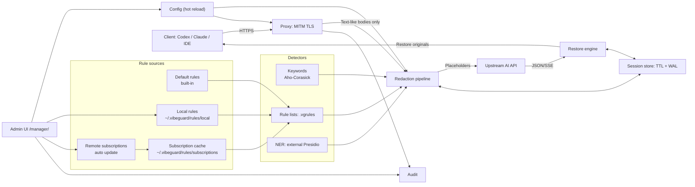

<p align="center">
  <br><br>
  <span>Uses just 1% memory while protecting 99% of your personal privacy.</span><br><br>
  <a href="LICENSE"></a>
  <a href="go.mod"></a>
  <a href="https://github.com/inkdust2021/VibeGuard/actions/workflows/ghcr.yml"></a>
  <a href="https://ghcr.io/inkdust2021/vibeguard"></a>
  <a href="https://github.com/inkdust2021/VibeGuard/stargazers"></a>
  <br>
  English | <a href="README.zh-CN.md">中文</a>
</p>


## Installation

```bash
# Mac/Linux
curl -fsSL https://vibeguard.top/install | bash

# Windows
powershell -NoProfile -ExecutionPolicy Bypass -Command "irm https://vibeguard.top/install.ps1 | iex"
```

## Introduction

VibeGuard is a lightweight MITM HTTPS proxy for protecting sensitive data when vibecoding. It aims to be out-of-the-box and minimize disruption, and it can also integrate optional NER.

**Privacy statement**: VibeGuard matches/redacts locally. It does not upload your raw sensitive content to any VibeGuard-controlled server or third-party analytics service; only **redacted** content is forwarded to your configured upstream AI API.

## Key Features

- **Matching rules**: rule lists (official + third-party) + keywords (exact string match) + optional named entity recognition (NER).
- **Rule lists**: upload/subscribe to `.vgrules` lists (remote subscriptions only require a URL). See `docs/README.md`.
- **Safe by default**: only scans text-like request bodies (e.g., `application/json`) with a 10MB limit.
- **Admin UI**: configure rules/certificates/sessions at `/manager/`, review per-request redaction hits (Audit), and tail backend debug logs at `#/logs`.
- **Admin auth**: the admin UI/API is protected by a password (set on first visit to `/manager/`).
- **At-rest encryption (keywords)**: keyword/exclude values are stored encrypted in `~/.vibeguard/config.yaml` using a key derived from the local CA private key (admin UI still shows plaintext). If you regenerate the CA, old encrypted values cannot be decrypted and must be reconfigured.
- **Secret files (optional)**: import secrets from local files (e.g. `.env`) via `patterns.secret_files` and redact them automatically.
- **Two interception modes**: `proxy.intercept_mode: global` or `targets`.
- **Hot reload**: rule/target updates from the admin UI take effect without restarting.

## Architecture


```mermaid
flowchart LR
  C[Client: Codex / Claude / IDE] -->|HTTPS| P[Proxy: MITM TLS]
  P -->|Text-like bodies only| PIPE[Redaction pipeline]
  PIPE -->|Placeholders| UP[Upstream AI API]
  UP -->|JSON/SSE| R[Restore engine]
  R -->|Restore originals| C

  subgraph DET[Detectors]
    KW[Keywords<br/>Aho-Corasick]
    RL[Rule lists: .vgrules]
    NER[NER: external Presidio]
  end
  KW --> PIPE
  RL --> PIPE
  NER --> PIPE

  subgraph RULES[Rule sources]
    DEF[Default rules<br/>built-in]
    LOCAL[Local rules<br/>~/.vibeguard/rules/local]
    SUB[Remote subscriptions<br/>auto update]
    CACHE[Subscription cache<br/>~/.vibeguard/rules/subscriptions]
  end
  DEF --> RL
  LOCAL --> RL
  SUB --> CACHE
  CACHE --> RL

  UI[Admin UI /manager/] --> CFG["Config (hot reload)"]
  UI --> LOCAL
  UI --> SUB
  CFG --> PIPE
  CFG --> P

  PIPE <--> SES[Session store: TTL + WAL]
  R <--> SES

  P --> AUD[Audit]
  UI --> AUD
```

## Screenshot


## Admin UI Security

- First visit to `http://127.0.0.1:28657/manager/` will ask you to set an admin password.
- The password is stored as a bcrypt hash in `~/.vibeguard/admin_auth.json` (permissions: `0600`).
- Forgot it? Stop VibeGuard, delete `~/.vibeguard/admin_auth.json`, then refresh `/manager/` to set a new one.

## Uninstall

The installed binary includes the uninstaller and works offline on macOS, Linux and Windows:

```bash
vibeguard uninstall
```

Before changing anything, it asks whether to keep configuration, CA private keys, logs and WAL. Answer `y` to keep them or `n` to delete them. For explicit or noninteractive use:

```bash
vibeguard uninstall --keep-config --non-interactive
vibeguard uninstall --purge --yes --non-interactive
```

`--yes` alone does not choose for you. `--dir PATH` selects the installation directory; by default it uses the running executable's directory. Windows also supports `--remove-path` to remove that directory from user PATH; use it only when the directory is dedicated to VibeGuard.

Uninstall stops the proxy, removes autostart, removes CA trust and installer shell/profile helpers, and deletes the binary. `--purge` deletes `~/.vibeguard`, including configuration, CA/private keys, logs/backups, session WAL and audit data. Project `.vibeguard.yaml`, custom files outside that directory, exported/downloaded certificates, shared installation directories and shell/profile safety backups remain user-owned. Restart your terminal to discard environment values/functions already loaded in the parent shell.

Cleanup failures return an error. If CA trust cannot be removed or verified, the binary and CA/configuration are preserved for retry. System trust removal may require administrator privileges (on macOS/Linux, run `sudo -v` before noninteractive removal). On Windows the running executable is deleted by a worker after the command exits: the printed temporary result file reports `complete` or `failed: ...`; check it before considering uninstall complete, then delete the result file if desired.

For older installations, the standalone scripts are still available (they retain configuration unless purge is selected):

```bash
curl -fsSL https://vibeguard.top/uninstall | bash
curl -fsSL https://vibeguard.top/uninstall | bash -s -- --purge --yes
# Docker-only: keep configuration and the existing manager password in the volume.
curl -fsSL https://vibeguard.top/uninstall | bash -s -- --docker --keep-config --yes
# Delete the container, data volume (including password) and local configuration.
curl -fsSL https://vibeguard.top/uninstall | bash -s -- --docker-volume --purge --yes
```

`--docker-volume` removes `vibeguard-data`, including the manager password, configuration, CA/private key, logs and WAL. `--docker` alone keeps the volume and its password. Docker availability/query/deletion failures return an error and preserve local configuration for retry. Run the host script for Docker-only installations; the CLI inside the container cannot uninstall host helpers.

```powershell
powershell -NoProfile -ExecutionPolicy Bypass -Command "& ([ScriptBlock]::Create((irm https://vibeguard.top/uninstall.ps1))) -KeepConfig"
powershell -NoProfile -ExecutionPolicy Bypass -Command "& ([ScriptBlock]::Create((irm https://vibeguard.top/uninstall.ps1))) -Purge -Yes"
```

## Configuration

- Global: `~/.vibeguard/config.yaml`
- Project override: `.vibeguard.yaml`
- Override path: `VIBEGUARD_CONFIG=/path/to/config.yaml`

Example: redact secrets from `.env` (prevents accidental exfiltration; it does not stop your client from reading files):

```yaml
patterns:
  secret_files:
    - path: .env
      format: dotenv
      enabled: true
```

## Usage

Use it in your coding CLI (does not affect your current terminal):

```bash
vibeguard claude [args...]  # replace with: codex / opencode / qwen / gemini
```

Use it for a specific command (does not affect your current terminal):

```bash
vibeguard run <command> [args...]
```

Use it in an IDE/other apps:

```bash
Set proxy to http://127.0.0.1:28657
```

## CLI Commands

Global flag:

- `-c, --config PATH`: config file (default `~/.vibeguard/config.yaml`).

### Start proxy (background by default)

```bash
vibeguard start [--foreground] [-c PATH]
```

- Default: prefers an installed autostart service; otherwise starts a background process.
- `--foreground`: run in foreground (debugging / service ExecStart).
- If `--config` is set, it runs in foreground (to avoid ambiguity).

### Stop proxy (background service/process)

```bash
vibeguard stop [-c PATH]
```

### Enable proxy only for Code Agents (does not affect your current terminal)

```bash
vibeguard opencode/claude/codex... [args...]
```

### Enable proxy only for a command (does not affect your current terminal)

```bash
vibeguard run <command> [args...]
```

### Init wizard (not needed if using install script)

```bash
vibeguard init [-c PATH]
```

Interactive config + CA generation.

### Trust CA certificate (not needed if using install script)

```bash
vibeguard trust --mode system|user|auto [-c PATH]
```

Installs the generated CA into a trust store. (May require `sudo`/Administrator.)

### Test a redaction rule

```bash
vibeguard test [pattern] [text] [-c PATH]
```

`pattern` is treated as a keyword (exact substring match).

Example:

```bash
vibeguard test "test123" "Please repeat the word I just said, and remove its first letter."
```

### Version

```bash
vibeguard version
```

### Shell completion

```bash
vibeguard completion bash|zsh|fish|powershell [--no-descriptions]
```

### Help

```bash
vibeguard --help
vibeguard help [command]
vibeguard [command] --help
```

## How to Verify It Works (Vibecoding)

1. Start the proxy: `vibeguard start` (the installer can do this automatically).
3. Launch your tool via VibeGuard (`vibeguard codex/claude/...`) or set your IDE/app proxy URL to `http://127.0.0.1:28657`.
4. In `/manager/`, check the **Audit** panel: each request shows whether redaction was attempted and how many matches were replaced.

## Development & Self-check

```bash
go test ./...
go vet ./...
gofmt -w .
```

## Included officially

VibeGuard is officially integrated by:

- OpenCode: https://github.com/inkdust2021/opencode-vibeguard

## Star History

[](https://www.star-history.com/#inkdust2021/VibeGuard&type=date&legend=top-left)
