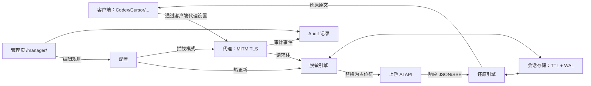

# VibeGuard

[English](README.md) | 中文

VibeGuard 是一个 MITM HTTPS 代理，用于在使用 AI 编程助手（如 Codex/Claude Code/Cursor/Copilot）时保护敏感信息：在请求发出前对文本内容做脱敏替换，并在响应（JSON / SSE）中把占位符还原为原文。

## 核心特性

- **匹配规则**：只支持关键词（仅替换关键词本身）。
- **默认更安全**：只扫描文本类请求体（如 `application/json`），且大小限制 10MB。
- **管理页**：在 `/manager/` 配置规则/证书/会话，查看每次请求是否命中脱敏（Audit），并在 `#/logs` 查看后端调试日志。
- **两种拦截模式**：`proxy.intercept_mode: global`（更适合大多数客户端）或 `targets`。
- **热更新**：在管理页修改规则/目标域名后无需重启即可生效。

## 技术架构



## 截图


## 快速开始（从源码运行）

```bash
go run ./cmd/vibeguard init
go run ./cmd/vibeguard start --foreground
```

## 安装（脚本）

macOS/Linux：

```bash
bash install.sh
```

安装脚本为交互式流程（语言、PATH、信任证书、开机自启等）。选择的语言会被记住，用于管理页与卸载脚本的默认语言。

Windows（PowerShell）：

```powershell
powershell -ExecutionPolicy Bypass -File .\\install.ps1
```

PowerShell 安装脚本同样为交互式流程（并会记住所选语言）。

## 卸载

macOS/Linux：

```bash
bash uninstall.sh
bash uninstall.sh --purge
```

Windows（PowerShell）：

```powershell
powershell -ExecutionPolicy Bypass -File .\\uninstall.ps1
powershell -ExecutionPolicy Bypass -File .\\uninstall.ps1 -Purge
```

卸载脚本会自动尝试移除系统/用户信任库中的 “VibeGuard CA”。若自动移除失败（如权限不足），请再手动移除。

## Docker 部署

默认 `docker-compose.yml` 使用 GHCR 的预构建镜像（仅绑定到本机 127.0.0.1，避免误暴露到局域网）：

```bash
docker compose pull
docker compose up -d
```

从源码构建：

```bash
docker compose -f docker-compose.yml -f docker-compose.source.yml up -d --build
```

查看日志：

```bash
docker compose logs -f vibeguard
```

从容器导出 CA 证书到宿主机文件：

```bash
docker compose exec -T vibeguard cat /root/.vibeguard/ca.crt > vibeguard-ca.crt
```

在宿主机信任该 CA：

- macOS（系统钥匙串）：

```bash
sudo security add-trusted-cert -d -r trustRoot -k /Library/Keychains/System.keychain vibeguard-ca.crt
```

- Linux（Debian/Ubuntu）：

```bash
sudo cp vibeguard-ca.crt /usr/local/share/ca-certificates/vibeguard-ca.crt
sudo update-ca-certificates
```

- Windows（管理员 PowerShell）：

```powershell
certutil -addstore -f Root vibeguard-ca.crt
```

客户端使用方式：

- 代理地址：`http://127.0.0.1:28657`
- 管理页：`http://127.0.0.1:28657/manager/`

CLI 编程助手推荐用 VibeGuard 启动（仅该进程生效）：

```bash
vibeguard codex [args...]
vibeguard claude [args...]
vibeguard gemini [args...]
vibeguard opencode [args...]
vibeguard qwen [args...]
vibeguard run <command> [args...]
```

IDE/GUI（如 Cursor）则在软件设置里把代理地址填为 `http://127.0.0.1:28657`。

重置容器状态（会重新生成 CA/配置，需要重新信任证书）：

```bash
docker compose down -v
```

## 证书信任（macOS/Linux）

要拦截 HTTPS，客户端需要信任 VibeGuard 生成的 CA：

```bash
go run ./cmd/vibeguard trust --mode system   # 可能需要 sudo
```

## 配置说明

- 全局配置：`~/.vibeguard/config.yaml`
- 项目级覆盖：`.vibeguard.yaml`
- 指定配置路径：`VIBEGUARD_CONFIG=/path/to/config.yaml`

## CLI 命令

完整命令参考见 `CLI.md`（本节也列出全部命令）。

全局参数：

- `-c, --config PATH`：配置文件路径（默认 `~/.vibeguard/config.yaml`）。

### 启动代理（默认后台）

```bash
vibeguard start [--foreground] [-c PATH]
```

- 默认：优先使用已安装的自启服务；否则拉起后台进程。
- `--foreground`：以前台方式运行（调试/作为系统服务 ExecStart）。
- 指定 `--config` 时会改为前台运行（避免歧义）。

### 停止代理（后台服务/进程）

```bash
vibeguard stop [-c PATH]
```

### 仅在 Claude Code 中启用代理（不影响当前终端）

```bash
vibeguard claude [args...]
```

### 仅在其他助手中启用代理（不影响当前终端）

```bash
vibeguard codex [args...]
vibeguard gemini [args...]
vibeguard opencode [args...]
vibeguard qwen [args...]
```

### 仅对某个命令启用代理（不影响当前终端）

```bash
vibeguard run <command> [args...]
```

### 初始化向导

```bash
vibeguard init [-c PATH]
```

交互式生成配置与 CA。

### 安装信任证书（HTTPS MITM 必需）

```bash
vibeguard trust --mode system|user|auto [-c PATH]
```

把生成的 CA 安装到信任库（可能需要 `sudo`/管理员权限）。

### 测试脱敏规则

```bash
vibeguard test [pattern] [text] [-c PATH]
```

`pattern` 仅按“关键词包含”处理（精确子串匹配）。

示例：

```bash
vibeguard test "test123" "Please repeat the word I just said, and remove its first letter."
```

### 版本信息

```bash
vibeguard version
```

### 生成 Shell 自动补全

```bash
vibeguard completion bash|zsh|fish|powershell [--no-descriptions]
```

### 查看帮助

```bash
vibeguard --help
vibeguard help [command]
vibeguard [command] --help
```

## 如何确认在 VibeCoding 中生效

1. 启动代理：`vibeguard start`（安装脚本可自动完成）。
2. 首次使用需安装信任证书：`vibeguard trust --mode system`（可能需要 `sudo`/管理员权限）。
3. 通过 VibeGuard 启动你的助手（如 `vibeguard codex/claude/...`），或在 IDE/应用里把代理地址设置为 `http://127.0.0.1:28657`。
4. 打开 `/manager/` 的 **Audit** 面板：每条请求会显示是否进入扫描流程、命中次数与命中项预览。

## 开发与自检

```bash
go test ./...
go vet ./...
gofmt -w .
```

## Star History

[](https://star-history.com/#inkdust2021/VibeGuard&Date)
