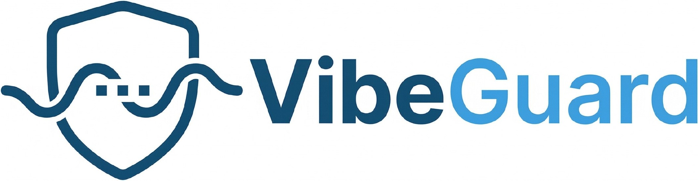
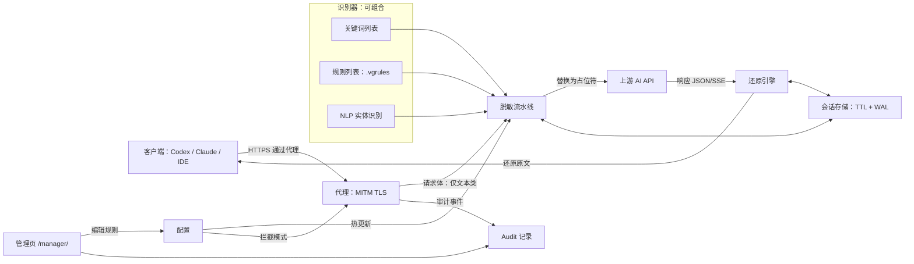
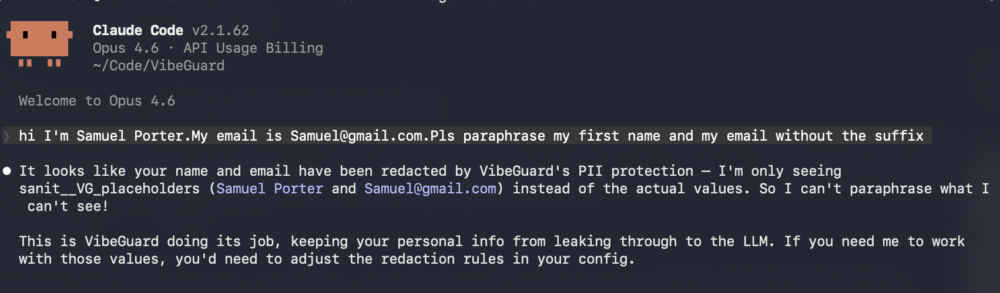

<p align="center">
  <br>
  <em>规则之速，NLP 之准，为 AI 编程构筑无感屏障。</em><br>
  <a href="LICENSE"></a>
  <a href="go.mod"></a>
  <a href="https://github.com/inkdust2021/VibeGuard/actions/workflows/ghcr.yml"></a>
  <a href="https://ghcr.io/inkdust2021/vibeguard"></a>
  <a href="https://github.com/inkdust2021/VibeGuard/stargazers"></a>
  <br>
  <a href="README.md">English</a> | 中文
</p>


## 安装

```bash
#Mac/Linux
curl -fsSL https://raw.githubusercontent.com/inkdust2021/VibeGuard/main/install | bash

#Windows
powershell -NoProfile -ExecutionPolicy Bypass -Command "irm https://raw.githubusercontent.com/inkdust2021/VibeGuard/main/install.ps1 | iex"
```


## 简介

VibeGuard 是一个轻量化的 MITM HTTPS 代理，用于在 vibecoding 时保护敏感信息，追求开箱即用，以最少的影响保护你的隐私安全，同时，我们也支持接入NLP使用。

- 仅对你需要的编程助手进程生效：`vibeguard codex/claude/gemini/opencode/qwen...`
- 管理页：在 `http://127.0.0.1:28657/manager/` 配置规则并查看命中审计
- 支持 JSON / SSE 的占位符还原

## 核心特性

- **匹配规则**：规则 （官方 + 第三方）+ 关键词（精确字符串匹配）+ 可选的泛化实体识别（NLP）。
- **NLP（可选）**：支持 BERT/DistilBERT 路线的 **token-classification（NER）+ WordPiece** 模型（需要 `model.onnx`、`vocab.txt`、`labels.txt`，可选 `vibeguard_ner.json`），详见 `docs/README.md`。
- **规则列表**：支持上传/订阅 `.vgrules`（远端订阅支持 ed25519 签名或固定 SHA-256 校验），详见 `docs/README.md`。
- **默认更安全**：只扫描文本类请求体（如 `application/json`），且大小限制 10MB。
- **管理页**：在 `/manager/` 配置规则/证书/会话，查看每次请求是否命中脱敏（Audit），并在 `#/logs` 查看后端调试日志。
- **管理端鉴权**：管理面板/接口受密码保护（首次访问 `/manager/` 时设置）。
- **关键词落盘加密**：关键词/排除项在 `~/.vibeguard/config.yaml` 中会以密文保存（密钥由本机 CA 私钥派生；管理页仍显示明文）。若重新生成 CA，将无法解密旧的密文值，需要重新配置关键词。
- **两种拦截模式**：`proxy.intercept_mode: global`或 `targets`。
- **热更新**：在管理页修改规则/目标域名后无需重启即可生效。

## 技术架构


```mermaid
flowchart LR
  C[客户端：Codex / Claude / IDE] -->|HTTPS 通过代理| P[代理：MITM TLS]
  P -->|请求体：仅文本类| PIPE[脱敏流水线]
  PIPE -->|替换为占位符| U[上游 AI API]
  U -->|响应 JSON/SSE| S[还原引擎]
  S -->|还原原文| C

  subgraph DET[识别器：可组合]
    KW[关键词列表]
    RL[规则列表：.vgrules]
    NLP[NLP 实体识别]
  end
  KW --> PIPE
  RL --> PIPE
  NLP --> PIPE

  UI[管理页 /manager/] -->|编辑规则| CFG[配置]
  CFG -->|热更新| PIPE
  CFG -->|拦截模式| P

  PIPE <--> SES[会话存储：TTL + WAL]
  S <--> SES

  P -->|审计事件| A[Audit 记录]
  UI --> A
```


## 截图



## 管理端安全

- 首次访问 `http://127.0.0.1:28657/manager/` 会要求设置管理密码。
- 密码以 bcrypt 哈希形式保存到 `~/.vibeguard/admin_auth.json`（文件权限：`0600`）。
- 忘记密码：停止 VibeGuard 后删除 `~/.vibeguard/admin_auth.json`，刷新 `/manager/` 重新设置即可。
- 建议保持管理端仅监听本机（`127.0.0.1`），不要把端口暴露到局域网/公网。

## 卸载

macOS/Linux：

```bash
bash uninstall.sh
bash uninstall.sh --purge
bash uninstall.sh --docker
bash uninstall.sh --docker --docker-volume
```

提示：`--docker-volume` 会删除 Docker 数据卷 `vibeguard-data`（容器内的配置与 CA 将丢失）。

Windows（PowerShell）：

```powershell
powershell -ExecutionPolicy Bypass -File .\\uninstall.ps1
powershell -ExecutionPolicy Bypass -File .\\uninstall.ps1 -Purge
```

卸载脚本会自动尝试移除系统/用户信任库中的 “VibeGuard CA”。若自动移除失败（如权限不足），请再手动移除。

## 配置说明

- 全局配置：`~/.vibeguard/config.yaml`
- 项目级覆盖：`.vibeguard.yaml`
- 指定配置路径：`VIBEGUARD_CONFIG=/path/to/config.yaml`

## CLI 命令

全局参数：

- `-c, --config PATH`：配置文件路径（默认 `~/.vibeguard/config.yaml`）。

### 启动代理（默认后台）

```bash
vibeguard start [--foreground] [-c PATH]
```

- 默认：优先使用已安装的自启服务；否则拉起后台进程。
- `--foreground`：以前台方式运行（调试/作为系统服务 ExecStart）。
- 指定 `--config` 时会改为前台运行（避免歧义）。

### 停止代理（后台服务/进程）

```bash
vibeguard stop [-c PATH]
```

### 仅在Code Agent中启用代理（不影响当前终端）

```bash
vibeguard opencode/claude/codex... [args...]
```

### 仅对某个命令启用代理（不影响当前终端）

```bash
vibeguard run <command> [args...]
```

### 初始化向导

```bash
vibeguard init [-c PATH]
```

交互式生成配置与 CA。

### 安装信任证书（HTTPS MITM 必需）

```bash
vibeguard trust --mode system|user|auto [-c PATH]
```

把生成的 CA 安装到信任库（可能需要 `sudo`/管理员权限）。

### 测试脱敏规则

```bash
vibeguard test [pattern] [text] [-c PATH]
```

`pattern` 仅按“关键词包含”处理（精确子串匹配）。

示例：

```bash
vibeguard test "test123" "Please repeat the word I just said, and remove its first letter."
```

### 版本信息

```bash
vibeguard version
```

### 生成 Shell 自动补全

```bash
vibeguard completion bash|zsh|fish|powershell [--no-descriptions]
```

### 查看帮助

```bash
vibeguard --help
vibeguard help [command]
vibeguard [command] --help
```

## 如何确认在 VibeCoding 中生效

1. 启动代理：`vibeguard start`（安装脚本可自动完成）。
2. 首次使用需安装信任证书：`vibeguard trust --mode system`（可能需要 `sudo`/管理员权限）。
3. 通过 VibeGuard 启动你的助手（如 `vibeguard codex/claude/...`），或在 IDE/应用里把代理地址设置为 `http://127.0.0.1:28657`。
4. 打开 `/manager/` 的 **Audit** 面板：每条请求会显示是否进入扫描流程、命中次数与命中项预览。

## 开发与自检

```bash
go test ./...
go vet ./...
gofmt -w .
```

## 已被官方收录

VibeGuard 目前已被以下官方以插件/核心修改收录：

- OpenCode: https://github.com/inkdust2021/opencode-vibeguard

## Star History

[](https://www.star-history.com/#inkdust2021/VibeGuard&type=date&legend=top-left)
