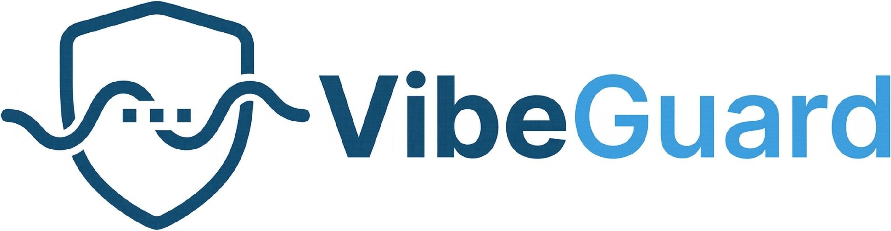
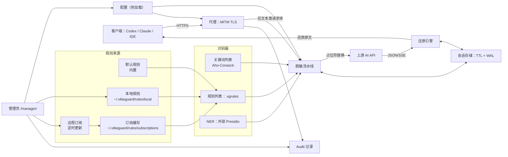
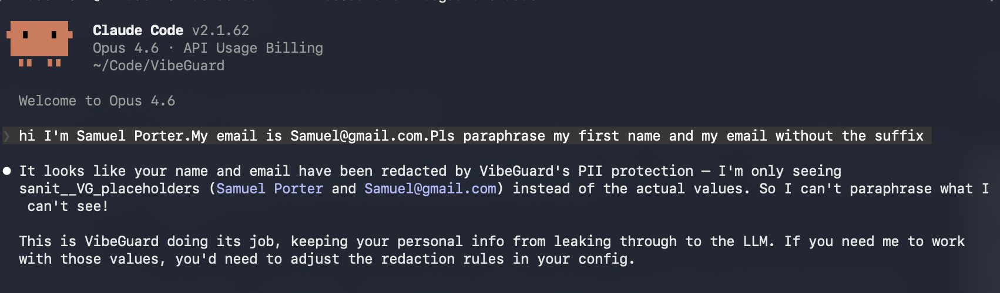

<p align="center">
  <br><br>
  <span>仅仅1%内存占用，给你99%隐私保护。</span><br><br>
  <a href="LICENSE"></a>
  <a href="go.mod"></a>
  <a href="https://github.com/inkdust2021/VibeGuard/actions/workflows/ghcr.yml"></a>
  <a href="https://ghcr.io/inkdust2021/vibeguard"></a>
  <a href="https://github.com/inkdust2021/VibeGuard/stargazers"></a>
  <br>
  <a href="README.md">English</a> | 中文
</p>


## 安装

```bash
#Mac/Linux
curl -fsSL https://vibeguard.top/install | bash

#Windows
powershell -NoProfile -ExecutionPolicy Bypass -Command "irm https://vibeguard.top/install.ps1 | iex"
```

## 简介

VibeGuard 是一个轻量化的 MITM HTTPS 代理，用于在 vibecoding 时保护敏感信息，追求开箱即用，以最少的影响保护你的隐私安全，同时也支持接入 NER 实体识别。

**隐私声明**：VibeGuard 的匹配/脱敏在本地完成，不会把你的原始敏感内容上传到任何 VibeGuard 自有服务器或第三方分析服务；仅将**脱敏后的内容**按你的配置转发给上游 AI 服务。

## 核心特性

- **匹配规则**：规则 （官方 + 第三方）+ 关键词（精确字符串匹配）+ 可选的命名实体识别（NER）。
- **规则列表**：支持上传/订阅 `.vgrules`（远端订阅仅需填写 URL），详见 `docs/README.md`。
- **默认更安全**：只扫描文本类请求体（如 `application/json`），且大小限制 10MB。
- **管理页**：在 `/manager/` 配置规则/证书/会话，查看每次请求是否命中脱敏（Audit），并在 `#/logs` 查看后端调试日志。
- **管理端鉴权**：管理面板/接口受密码保护（首次访问 `/manager/` 时设置）。
- **关键词落盘加密**：关键词/排除项在 `~/.vibeguard/config.yaml` 中会以密文保存（密钥由本机 CA 私钥派生；管理页仍显示明文）。若重新生成 CA，将无法解密旧的密文值，需要重新配置关键词。
- **敏感文件（可选）**：通过 `patterns.secret_files` 从本地文件（如 `.env`）导入 secret 值并自动脱敏，避免误发到上游。
- **两种拦截模式**：`proxy.intercept_mode: global`或 `targets`。
- **热更新**：在管理页修改规则/目标域名后无需重启即可生效。

## 技术架构


```mermaid
flowchart LR
  C[客户端：Codex / Claude / IDE] -->|HTTPS| P[代理：MITM TLS]
  P -->|仅文本类请求体| PIPE[脱敏流水线]
  PIPE -->|占位符替换| UP[上游 AI API]
  UP -->|JSON/SSE| R[还原引擎]
  R -->|还原原文| C

  subgraph DET[识别器]
    KW[关键词列表<br/>Aho-Corasick]
    RL[规则列表：.vgrules]
    NER[NER：外部 Presidio]
  end
  KW --> PIPE
  RL --> PIPE
  NER --> PIPE

  subgraph RULES[规则来源]
    DEF[默认规则<br/>内置]
    LOCAL[本地规则<br/>~/.vibeguard/rules/local]
    SUB[远程订阅<br/>定时更新]
    CACHE[订阅缓存<br/>~/.vibeguard/rules/subscriptions]
  end
  DEF --> RL
  LOCAL --> RL
  SUB --> CACHE
  CACHE --> RL

  UI[管理页 /manager/] --> CFG["配置（热加载）"]
  UI --> LOCAL
  UI --> SUB
  CFG --> PIPE
  CFG --> P

  PIPE <--> SES[会话存储：TTL + WAL]
  R <--> SES

  P --> AUD[Audit 记录]
  UI --> AUD
```


## 截图



## 管理端安全

- 首次访问 `http://127.0.0.1:28657/manager/` 会要求设置管理密码。
- 密码以 bcrypt 哈希形式保存到 `~/.vibeguard/admin_auth.json`。
- 忘记密码：停止 VibeGuard 后删除 `~/.vibeguard/admin_auth.json`，刷新 `/manager/` 重新设置即可。

## 卸载

安装后的程序内置卸载脚本，macOS、Linux 和 Windows 均可离线执行：

```bash
vibeguard uninstall
```

执行任何清理前，会询问是否保留配置、CA 私钥、日志和 WAL。输入 `y` 保留，输入 `n` 删除，由用户决定。也可以明确指定，适合自动化使用：

```bash
vibeguard uninstall --keep-config --non-interactive
vibeguard uninstall --purge --yes --non-interactive
```

单独指定 `--yes` 不会替用户选择。`--dir PATH` 指定安装目录，默认使用当前程序所在目录。Windows 可追加 `--remove-path` 移除用户 PATH 中的安装目录；仅在该目录专用于 VibeGuard 时使用。

卸载会停止代理、移除自启服务、撤销 CA 信任、清理安装时写入的 shell/Profile 助手并删除程序。`--purge` 还会删除整个 `~/.vibeguard`，包括配置、证书及私钥、日志及备份、会话 WAL 和审计数据。项目 `.vibeguard.yaml`、目录外的自定义文件、导出/下载的证书、共用安装目录和 shell/Profile 安全备份由用户管理。卸载后重开终端，让父 shell 已加载的环境变量和函数失效。

清理失败会返回错误；CA 信任移除或检查失败时，会保留程序、证书和配置供重试。系统信任库可能需要管理员权限（macOS/Linux 非交互卸载前可执行 `sudo -v`）。Windows 通过后台任务在命令退出后删除正在运行的程序：输出中的临时结果文件记录 `complete` 或 `failed: ...`，请检查结果后再确认卸载完成，结果文件可自行删除。

旧版本仍可使用独立卸载脚本（未选择 purge 时保留配置）：

```bash
curl -fsSL https://vibeguard.top/uninstall | bash
curl -fsSL https://vibeguard.top/uninstall | bash -s -- --purge --yes
# Docker-only 安装：删除容器，并按需删除数据卷。
curl -fsSL https://vibeguard.top/uninstall | bash -s -- --docker --docker-volume --yes
```

`--docker-volume` 会删除 `vibeguard-data`（容器配置与 CA）。Docker-only 安装应运行宿主机卸载脚本，容器内 CLI 无法卸载宿主机助手。

```powershell
powershell -NoProfile -ExecutionPolicy Bypass -Command "& ([ScriptBlock]::Create((irm https://vibeguard.top/uninstall.ps1))) -KeepConfig"
powershell -NoProfile -ExecutionPolicy Bypass -Command "& ([ScriptBlock]::Create((irm https://vibeguard.top/uninstall.ps1))) -Purge -Yes"
```

## 配置说明

- 全局配置：`~/.vibeguard/config.yaml`
- 项目级覆盖：`.vibeguard.yaml`
- 指定配置路径：`VIBEGUARD_CONFIG=/path/to/config.yaml`

示例：从 `.env` 导入 secret 并自动脱敏（只能防止“发出去”，无法阻止客户端读取文件）：

```yaml
patterns:
  secret_files:
    - path: .env
      format: dotenv
      enabled: true
```

## 使用教程

在你的编程CLI中使用（不影响当前终端）

```bash
vibeguard claude [args...]     #claude可换为codex、opencode、qwen、gemini
```

在指定的命令中使用（不影响当前终端）

```bash
vibeguard run <command> [args...]
```

在IDE/OpenClaw等其它项目中使用

```bash	
设置代理为http://127.0.0.1:28657
```

## CLI 命令

全局参数：

- `-c, --config PATH`：配置文件路径（默认 `~/.vibeguard/config.yaml`）。

### 启动代理（默认后台）

```bash
vibeguard start [--foreground] [-c PATH]
```

- 默认：优先使用已安装的自启服务；否则拉起后台进程。
- `--foreground`：以前台方式运行。
- 指定 `--config` 时会改为前台运行。

### 停止代理（后台服务/进程）

```bash
vibeguard stop [-c PATH]
```

### 在你的编程CLI中使用（不影响当前终端）

```bash
vibeguard opencode/claude/codex... [args...]
```

### 在指定的命令中使用（不影响当前终端）

```bash
vibeguard run <command> [args...]
```

### 初始化向导（使用安装命令无需使用）

```bash
vibeguard init [-c PATH]
```

交互式生成配置与 CA。

### 安装信任证书（使用安装命令无需使用）

```bash
vibeguard trust --mode system|user|auto [-c PATH]
```

把生成的 CA 安装到信任库（可能需要 `sudo`/管理员权限）。

### 测试脱敏规则

```bash
vibeguard test [pattern] [text] [-c PATH]
```

`pattern` 仅按“关键词包含”处理（精确子串匹配）。

示例：

```bash
vibeguard test "test123" "Please repeat the word I just said, and remove its first letter."
```

### 版本信息

```bash
vibeguard version
```

### 生成 Shell 自动补全

```bash
vibeguard completion bash|zsh|fish|powershell [--no-descriptions]
```

### 查看帮助

```bash
vibeguard --help
vibeguard help [command]
vibeguard [command] --help
```

## 如何确认在 VibeCoding 中生效

1. 启动代理：`vibeguard start`（安装脚本可自动完成）。
3. 通过 VibeGuard 启动你的助手（如 `vibeguard codex/claude/...`），或在 IDE/应用里把代理地址设置为 `http://127.0.0.1:28657`。
4. 打开 `/manager/` 的 **Audit** 面板：每条请求会显示是否进入扫描流程、命中次数与命中项预览。

## 开发与自检

```bash
go test ./...
go vet ./...
gofmt -w .
```

## 已被官方收录

VibeGuard 目前已被以下官方以插件/核心修改收录：

- OpenCode: https://github.com/inkdust2021/opencode-vibeguard

## Star History

[](https://www.star-history.com/#inkdust2021/VibeGuard&type=date&legend=top-left)
